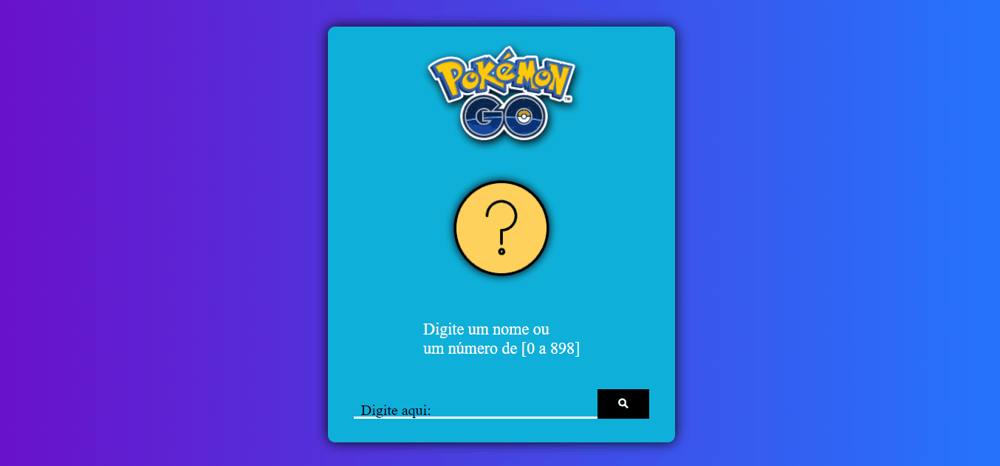

# API Pokémon Go

### Esse projeto foi desenvolvido para consumir dados de uma API!

- Foi usado o fetch para fazer o cosumo da API Pokémon!
- Por meio desse projeto pode-se ver 898 Pokémons!
- Pode-se ver os nomes dos mesmo!

### Loyout para notebook e desktop

### Layout para celulares e tablets

🚀Tecnologias usadas:
- ✔HTML
- ✔CSS
- ✔JAVASCRIPT

